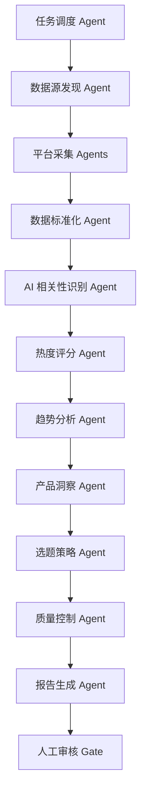

# AI 热点数据多 Agent 方案

本文档沉淀本工程的产品拆解和工程映射，便于理解 `langgraph-study` 当前实现了什么、后续应该怎么扩展。

## 目标

围绕抖音、小红书、微信公众号、今日头条等内容平台，建立一套 AI 相关热点数据分析工作流。系统覆盖账号信息、文章详情、作品列表、搜索查询等维度，把平台内容数据转化为热点榜、跨平台趋势、产品机会卡片和选题建议。

## 总体协作流



## Agent 分工

### 任务调度 Agent

接收业务目标，例如“今天 AI 应用热点”“某个 AI 产品在小红书的讨论趋势”“微信生态里的 AI 创业内容”。它决定需要覆盖的平台、关键词、时间窗口和数据维度。

工程映射：`app.agents.task_router.TaskRouterAgent`

### 数据源发现 Agent

把模糊需求转成可执行的数据源计划，包括平台、接口类型、查询词、账号 ID、分页策略和优先级。

工程映射：`app.agents.source_discovery.SourceDiscoveryAgent`

### 平台采集 Agents

按平台处理数据采集差异，包括抖音、小红书、微信公众号和今日头条。每个平台都可以替换为真实 API client，当前工程先提供 mock client 方便本地跑通流程。

工程映射：

- `app.agents.platform_collection.PlatformCollectionAgent`
- `app.tools.content_api.ContentApiClient`
- `app.tools.content_api.MockContentApiClient`

### 数据标准化 Agent

把不同平台返回的数据统一成内部结构，统一字段包括 `platform`、`content_id`、`author`、`title`、`text`、`media_type`、`published_at`、`metrics`、`url`、`raw_payload`、`source_api`。

工程映射：`app.agents.normalization.NormalizationAgent`

### AI 相关性识别 Agent

判断内容是否真的和 AI 相关，避免只因标题带“智能”“工具”“机器人”等词就误判。当前覆盖大模型、AI 产品、AI 内容生成、AI 编程、AI 商业化、AI 政策等方向。

工程映射：`app.agents.ai_relevance.AIRelevanceAgent`

### 热度评分 Agent

基于平台互动数据和内容新鲜度计算统一热度分。不同平台可以有不同权重，例如抖音偏播放/点赞/评论/转发，小红书偏收藏/评论/点赞，微信公众号偏阅读/在看/点赞/留言。

工程映射：`app.agents.hotness_scoring.HotnessScoringAgent`

### 趋势分析 Agent

聚合同主题内容，识别“单条爆款”和“持续趋势”的区别，输出趋势名称、代表内容、涉及平台、热度走势和证据链。

工程映射：`app.agents.trend_analysis.TrendAnalysisAgent`

### 产品洞察 Agent

以 AI 产品经理视角，把趋势翻译成产品机会，输出用户痛点、产品机会、验证假设、目标用户和跟进建议。

工程映射：`app.agents.product_insight.ProductInsightAgent`

### 选题策略 Agent

将趋势与洞察转成可发布的内容选题或研究方向，并按平台输出不同表达方式：抖音短视频、小红书图文笔记、微信公众号深度文章、今日头条热点解读。

工程映射：`app.agents.content_strategy.ContentStrategyAgent`

### 质量控制 Agent

检查重复内容、低置信度内容、缺失趋势、疑似异常数据等问题，并决定是否需要人工审核。

工程映射：`app.agents.quality_control.QualityControlAgent`

### 报告生成 Agent

整合前面 agent 的结构化结果，生成可追溯的报告摘要。它不重新判断事实，只引用已有趋势、洞察、内容 ID 和质量标记。

工程映射：`app.agents.report_generation.ReportGenerationAgent`

## 共享数据模型

核心模型集中在 `app/schemas/hotspot.py`：

- `HotspotTask`：分析任务和范围。
- `SourcePlan`：平台数据源计划。
- `RawContent`：平台原始返回。
- `NormalizedContent`：标准化内容。
- `AIRelevanceResult`：AI 相关性判断。
- `HotnessScore`：统一热度评分。
- `TrendCluster`：趋势聚类。
- `ProductInsight`：产品机会卡片。
- `ContentStrategy`：平台选题建议。
- `HotspotReport`：最终报告。
- `HotspotState`：贯穿整个 graph 的共享状态。

## 首版 MVP 范围

首版优先覆盖：

- 平台：抖音、小红书、微信公众号；今日头条作为补充发现源。
- 数据维度：搜索查询、作品列表、文章详情、账号信息。
- 输出形态：今日 AI 热点榜、跨平台趋势、产品机会卡片、平台选题建议。
- 数据策略：保留原始 payload 和标准化结果，方便后续复盘和替换真实 API。

共享常量集中在 `app/agents/constants.py`，包括 AI 分类关键词和平台权重。

## 工作流入口

工作流定义在 `app/graphs/ai_hotspot_graph.py`。

当前提供两种运行方式：

- 安装 `langgraph` 时，可通过 `build_langgraph_app()` 编译真实 LangGraph workflow。
- 未安装依赖时，可通过 `SequentialHotspotGraph` 顺序执行同样的节点，方便本地研究和演示。

运行 demo：

```bash
python -m app.graphs.ai_hotspot_graph
```

## 后续扩展方向

- 首个推荐微信真实数据适配器使用 `app.tools.wechat_download_api.WechatDownloadApiClient`，对接自建 `wechat-download-api`，用于免费验证公众号搜索、文章列表和文章详情链路。
- 替换 `MockContentApiClient` 为真实内容 API client。
- 为每个平台拆出独立采集 agent，独立处理限流、字段映射和失败重试。
- 将规则型 AI 相关性、趋势、洞察节点逐步替换为 LLM prompt chain。
- 增加数据库持久化，保留原始内容、标准化内容、评分结果和人工审核结果。
- 增加 FastAPI 接口，支持发起任务、查看报告、人工审核和回放历史任务。
